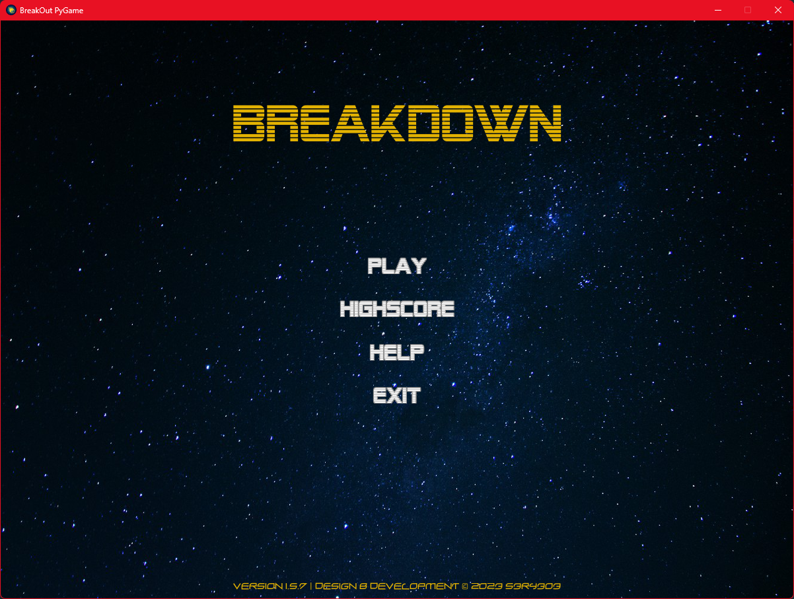
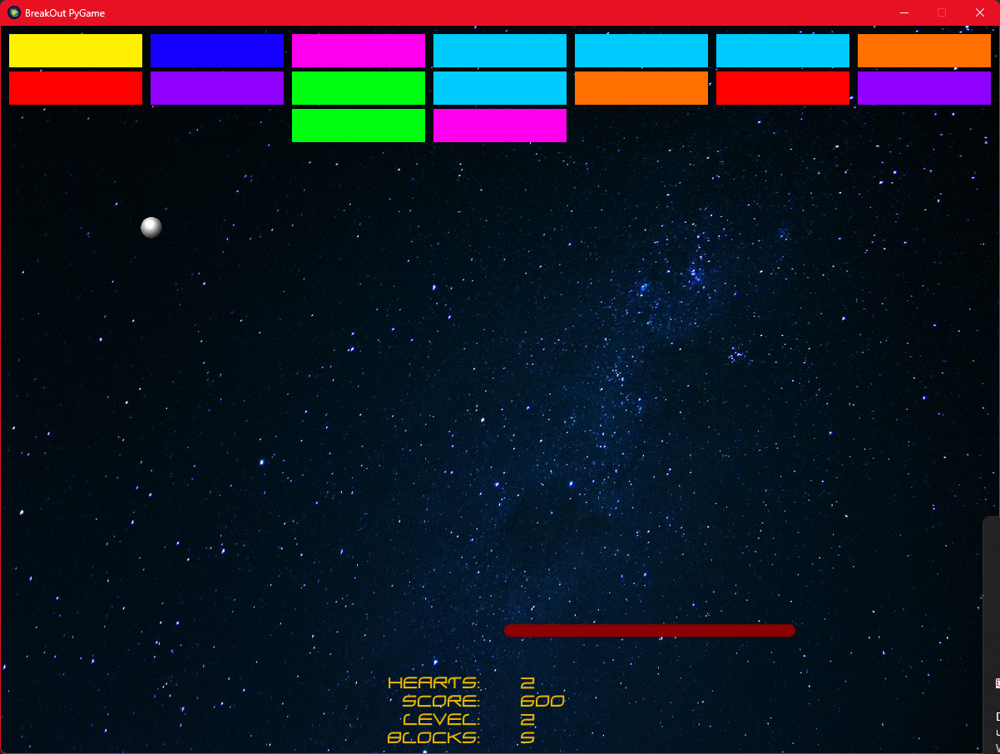
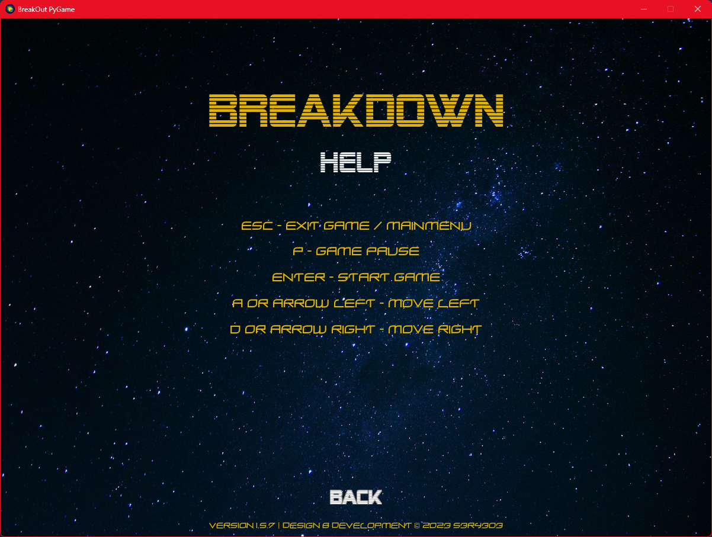
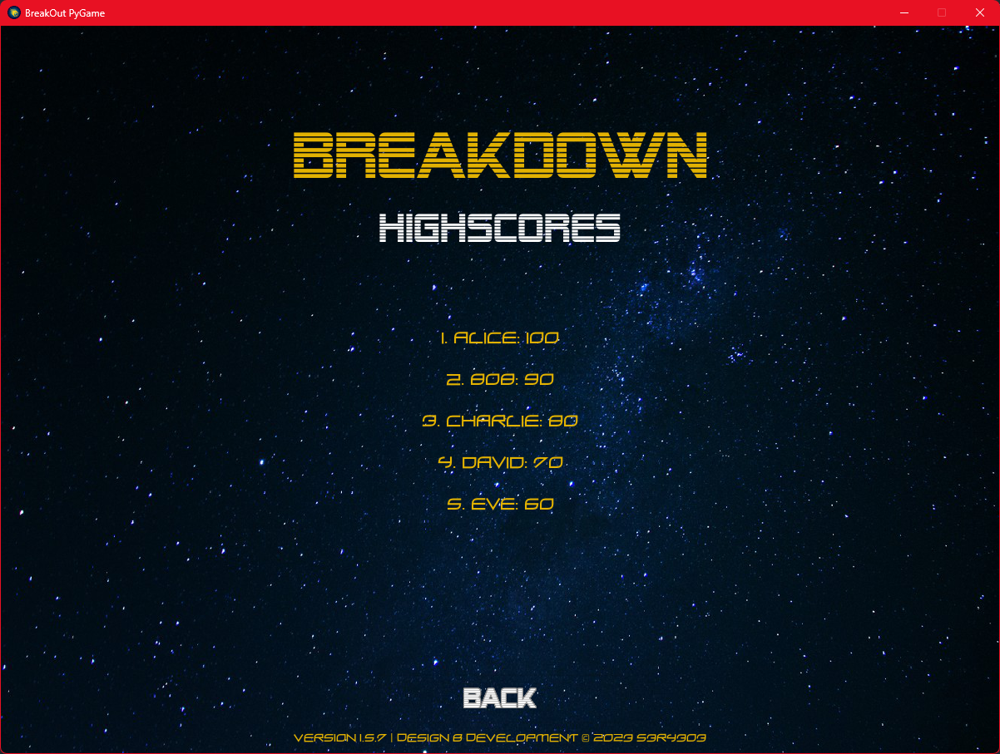

# Break-Out - PyGame #

> This is a clone from classic game Break-Out. This game was made with Python 11.1 and PyGame & PyGame GUI.
>
> The game is currently on development state and can have some bugs, if you face some please open a new issue.

## Installation ##

### Option 1 ###

>To install it just download the zip file and extract it where ever you want.
>
>Please Notice that this software is only tested on Windows 10/11 systems, it can work on other OS too but no guarantee.
>
>After that run the "Setup-BreakOut-PyGame.exe" that you have extracted.
>
>Follow the steps at the installer.
>
>After that you can run the Game in the installation Folder or use the Shortcut that have been created.

### Option 2 ###

> You can also run the pure source code for this you need follow dependencies
>
> - Python Version 3.8 ->
> - Python Lib 'PyGame'
> - Python Lib 'PyGame GUI'
>
> First off Download the project:
>
> Via GIT:
>
> ```cmd
>   git clone https://github.com/sera619/BreakOut-PyGame.git
> ```
>
> Or just click the green __Code__ Button above.
>
>
> After you downloaded the project you need to install all dependencies:
>
> ```cmd
>   pip install -r requirements.txt
>```
>
> After that you can run
>
> ```cmd
>   python main.py 
>```

## Screenshots ##

> - Some early Screenshots
>
>   - 
>
>   - 
>
>   - 
>
>   - 
>